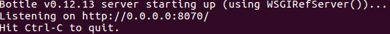

# ReNomIMG v2.0

ReNom IMG is model developing tool for image recognition tasks.

##### ReNomIMG - https://www.renom.jp/packages/renomimg/index.html

## Recommended Environment
- OS: Ubuntu 16.04
- Browser: Google Chrome(version 63.0.3239.132)
- Python: >=3.5

## Install
ReNomIMG requires ReNom.

If you haven't installed ReNom, you need to install ReNom from www.renom.jp.

## Install ReNomIMG package
Linux user can install ReNomIMG from Wheel package.

Other os user can't install from Wheel package but can install from source.

The Wheel package is provided at:

`https://grid-devs.gitlab.io/ReNomIMG/bin/renom_img-VERSION-cp36-cp36m-linux_x86_64.whl`

(VERSION is stands for actual version number e.g. 0.0.1)

You can install the wheel package with pip3 command::

- For Python3.5
`pip3 install https://grid-devs.gitlab.io/ReNomIMG/bin/renom_img-2.0.0-cp35-cp35m-linux_x86_64.whl`

- For Python3.6
`pip3 install https://grid-devs.gitlab.io/ReNomIMG/bin/renom_img-2.0.0-cp36-cp36m-linux_x86_64.whl`

### Install from source
For installing ReNomIMG, download the repository from following url.

`git clone https://github.com/ReNom-dev-team/ReNomIMG.git`

And move into ReNomIMG directory.

`cd ReNomIMG`

Then install all required packages.

`pip install -r requirements.txt`

And install renom module using following command.

`pip install -e .`

At last, build extension modules.

`python setup.py build`

## How to use ReNomIMG

Please follow this link. 

- ReNomIMG - renom.jp

http://renom.jp/packages/renomimg/index.html

### Quick start - Start with example data.
Following command setups example dataset[PASCAL VOC].
You can immediately try ReNomIMG with this example dataset.

`renom_img setup_example`

This command will create `datasrc` and `storage` directory.

### Quck start - How to start

1.Type following command in ReNomIMG directory.

`python -m renom_img`

Or, following command is available from 0.7beta.

`renom_img`

Second command can be called in any folder and creates `datasrc` folder in current directory.
Please set your dataset to the created directory.

If the server starts, you will see a message like below.

## License

“ReNomIMG” is provided by GRID inc., as subscribed software.  By downloading ReNomIMG, you are agreeing to be bound by our ReNom Subscription agreement between you and GRID inc.
To use ReNomIMG for commercial purposes, you must first obtain a paid license. Please contact us or one of our resellers.  If you are an individual wishing to use ReNomIMG for academic, educational and/or product evaluation purposes, you may use ReNomIMG royalty-free.
The ReNom Subscription agreements are subject to change without notice. You agree to be bound by any such revisions. You are responsible for visiting www.renom.jp to determine the latest terms to which you are bound.

[PASCAL VOC]:http://host.robots.ox.ac.uk/pascal/VOC/
